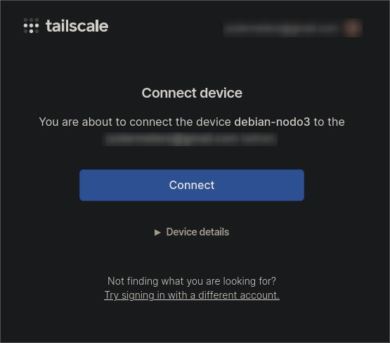

# Parámetros de instalación Debian 13

**Objetivo**: Instalación del sistema operativo base Debian para la virtualización de nodos e instalación de Kubernetes

## Máquina Virtual
- Sistema Operativo: Debian 13.3.0 amd64 (Trixie)
- ISO: debian-13.3.0-amd64-netinst.iso
- Sistema: VM VBox Manager
- Hardware:
    - RAM: 4096MB
    - CPU: 2 cores

## Configuración Inicial
- Fecha de instalación: 07/03/2026
- Idioma: Español
- País/región: España
- Zona horaria: Europe/Madrid
- Teclado: Español

- Hostname:
    - Nodo 1: debian-nodo1
    - Nodo 2: debian-nodo2
    - Nodo 3: debian-nodo3
    - Nodo 4: debian-nodo4

- Usuario: usuario1 añadido manualmente al grupo de sudoers

- Paquetes adicionales en la instalación:
    - SSH server
    - Herramientas básicas del sistema

- Paquetes de sistema (apt):
    - curl

## Configuración de Tailscale

```bash
# Descarga oficial
curl -fsSL https://tailscale.com/install.sh | sh

# Inicialización
sudo tailscale up

# Obtenemos la identificación del nodo de la salida
To authenticate, visit:
    https://login.tailscale.com/a/<ID>
```
Completamos añadir la máquina a través del enlace obtenido:


### TailNet IPs:
- nodo1: 100.126.156.35
- nodo2: 100.78.239.126
- nodo3: 100.115.184.93
- nodo4: 100.87.128.22
